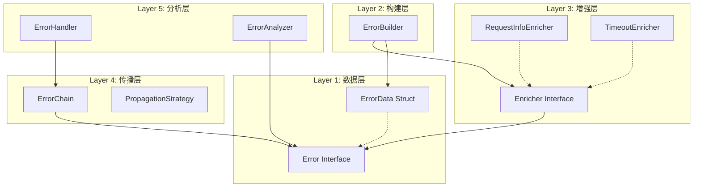
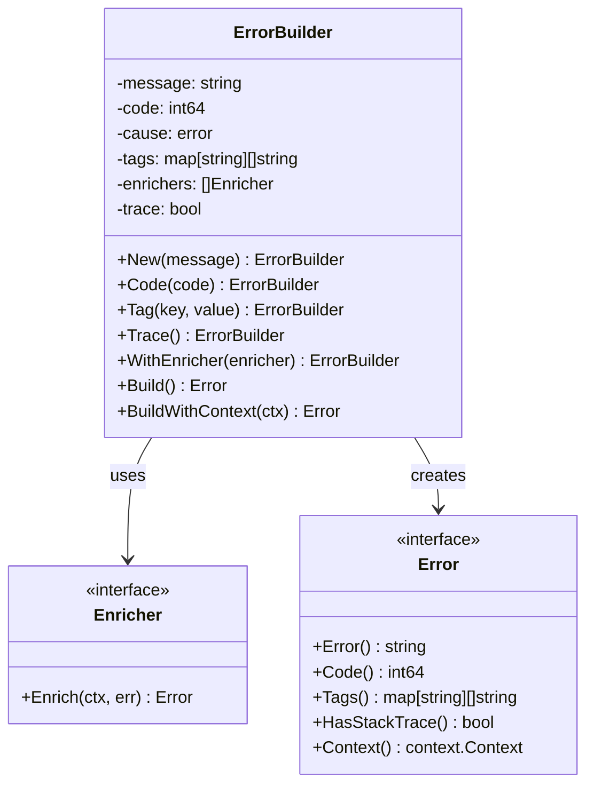

# IRR v0.2 架构设计文档

## 📋 设计概述

IRR v0.2 基于**错误处理的本质思考**，从底层原理出发，构建现代化、可组合的企业级错误处理系统。

## 🔬 错误处理的本质分析

### 1. 错误的生命周期

```
错误发生 → 错误感知 → 上下文收集 → 错误传播 → 处理决策 → 用户反馈
    ↓         ↓         ↓         ↓         ↓         ↓
  异常事件   检测机制   信息丰富   传递链路   业务逻辑   最终呈现
```

### 2. 传统错误处理的根本问题

#### 问题1: 信息丢失
```go
// 传统方式 - 信息在传播中逐渐丢失
err := db.Query(...)  // 原始错误: "connection timeout"
if err != nil {
    return fmt.Errorf("query failed: %w", err)  // 只有消息包装
}
// 丢失了: 发生时间、调用栈、业务上下文、错误分类
```

#### 问题2: 上下文割裂
```go
// 传统方式 - 上下文信息分散
log.Printf("User %s query failed", userID)       // 日志记录
metrics.Increment("db.query.error")              // 指标上报  
return fmt.Errorf("database error")              // 错误返回
// 问题: 三个动作相互独立，难以关联分析
```

#### 问题3: 处理逻辑混乱
```go
// 传统方式 - 错误处理与业务逻辑纠缠
func GetUser(id string) (*User, error) {
    user, err := db.Get(id)
    if err != nil {
        log.Error(err)                    // 日志逻辑
        metrics.Increment("error")        // 指标逻辑  
        return nil, fmt.Errorf("failed")  // 错误逻辑
        // 业务逻辑与基础设施逻辑混合
    }
    return user, nil
}
```

### 3. IRR的设计哲学

#### 哲学1: 错误即数据结构
错误不只是字符串，而是承载丰富信息的数据结构，包含:
- **基础信息**: 消息、错误码、原因链
- **上下文信息**: 调用栈、业务标签、运行时状态  
- **元信息**: 创建时间、严重程度、分类标识

#### 哲学2: 职责分离原则
- **创建阶段**: 纯粹的错误信息构建
- **丰富阶段**: 上下文信息的增强
- **传播阶段**: 结构化的错误传递
- **处理阶段**: 基于错误结构的智能决策

#### 哲学3: 可组合架构
每个组件都有清晰的输入输出，可以灵活组合:
```
ErrorBuilder → Enricher → Error → Handler → Response
     ↑           ↑         ↑        ↑         ↑
   构建逻辑    上下文逻辑  载体结构  处理逻辑  最终输出
```

## 🏗️ 分层架构设计

### 整体架构UML图



### Layer 1: 数据层 - 错误的结构化表示

#### 核心数据结构
```go
type ErrorData struct {
    // 基础信息
    Message   string
    Code      int64
    Timestamp time.Time
    
    // 关联信息  
    Cause     error
    ErrorID   string
    
    // 上下文信息
    Tags      map[string][]string
    Context   context.Context
    
    // 调试信息
    StackTrace []Frame
    Location   SourceLocation
}
```

#### 设计原理
- **不可变性**: 错误创建后结构不变，保证线程安全
- **富信息**: 包含调试、业务、运维所需的所有信息
- **可序列化**: 支持跨服务传输和持久化存储

### Layer 2: 构建层 - 错误的创建机制

#### Builder模式的深层考虑

**为什么选择Builder而不是构造函数？**

1. **参数灵活性**: 错误信息的维度多样化
   ```go
   // 构造函数方式的问题
   NewError(msg, code, cause, tags, trace, ctx) // 参数过多
   
   // Builder方式的优势
   New(msg).Code(code).Tag(k,v).Trace().Build() // 按需组合
   ```

2. **语义清晰性**: 每个方法都有明确意义
   ```go
   New("database failed").     // 创建基础错误
     Code(1001).              // 设置错误分类
     Tag("table", "users").   // 添加业务上下文  
     Trace().                 // 启用调试信息
     Build()                  // 完成构建
   ```

3. **扩展友好性**: 新增属性不破坏现有API
   ```go
   // 未来可以无缝添加新方法
   New(msg).Severity(HIGH).Timeout(5*time.Second).Build()
   ```

#### ErrorBuilder UML类图和方法链



**语法糖层次**:
- **基础构建**: `New()` → `Code()` → `Tag()` 
- **功能增强**: `Trace()` → `WithEnricher()`
- **最终构建**: `Build()` | `BuildWithContext()`

### Layer 3: 增强层 - 上下文的丰富机制

#### Enricher模式的设计原理

**为什么需要Enricher分离？**

1. **关注点分离**: 错误创建 vs 上下文丰富
   ```go
   // 错误创建 - 纯粹的业务逻辑
   err := New("user not found").Code(404)
   
   // 上下文丰富 - 基础设施逻辑
   enriched := err.WithEnricher(RequestTracer).
                  WithEnricher(TimeoutDetector).
                  BuildWithContext(ctx)
   ```

2. **可插拔性**: 不同环境需要不同的上下文信息
   ```go
   // 开发环境 - 详细调试信息
   devEnrichers := []Enricher{
       StackTraceEnricher,
       LocalDebugEnricher,
   }
   
   // 生产环境 - 精简上下文信息
   prodEnrichers := []Enricher{
       RequestIDEnricher,
       UserContextEnricher,
   }
   ```

3. **性能控制**: 按需启用昂贵的操作
   ```go
   // 只在需要时才执行堆栈捕获
   err := New(msg).
     WithEnricher(ConditionalTraceEnricher{
       Condition: func(ctx) bool { 
         return ctx.Value("debug") == true 
       },
     }).BuildWithContext(ctx)
   ```

#### 内置Enricher的设计

**RequestInfoEnricher - 请求追踪增强**
```go
功能: 从Context中提取请求相关信息
输入: context.Context (包含trace_id, user_id, session_id等)
输出: 添加了请求标签的Error
应用场景: Web服务、gRPC服务的请求追踪
```

**TimeoutEnricher - 超时检测增强**
```go  
功能: 检测并标记超时相关的错误状态
输入: context.Context (检查deadline和cancellation)
输出: 添加了超时信息的Error  
应用场景: 长时间运行的操作，帮助区分业务错误vs基础设施错误
```

**SecurityEnricher - 安全上下文增强**
```go
功能: 添加安全相关的上下文信息，同时保护敏感数据
输入: 包含认证信息的Context
输出: 添加了脱敏安全标签的Error
应用场景: 金融、医疗等对安全有严格要求的系统
```

### Layer 4: 传播层 - 错误的传递机制

#### 错误链的构建原理

**为什么需要错误链？**

传统的错误包装会丢失层次信息:
```go
// 传统包装 - 扁平化信息
fmt.Errorf("API call failed: %w", 
    fmt.Errorf("HTTP request failed: %w",
        fmt.Errorf("DNS resolution failed")))
```

IRR的分层错误链:
```go
// 分层错误链 - 保持结构化信息
DatabaseLayer: "connection pool exhausted"
    ↓ (caused by)  
NetworkLayer: "TCP connection timeout"  
    ↓ (caused by)
InfrastructureLayer: "network interface down"
```

#### 错误传播的智能路由

基于错误的结构化信息，实现智能的传播策略:

```go
type PropagationStrategy interface {
    ShouldPropagate(err Error) bool
    Transform(err Error) Error  
}

// 示例：基于错误级别的传播策略
type SeverityBasedStrategy struct {
    MaxSeverity Severity
}

func (s *SeverityBasedStrategy) ShouldPropagate(err Error) bool {
    return err.Severity() <= s.MaxSeverity
}
```

### Layer 5: 分析层 - 错误的智能处理

#### Handler模式的设计哲学

**集中式 vs 分布式错误处理**

传统分布式处理的问题:
```go
// 每个地方都要写相似的错误处理逻辑
if err != nil {
    log.Error(err)
    metrics.Increment("error") 
    return fmt.Errorf("operation failed")
}
```

IRR的集中式处理:
```go
// 统一的错误处理入口
type ErrorHandler struct {
    Logger   Logger
    Metrics  MetricsCollector
    Alerting AlertManager
}

func (h *ErrorHandler) Handle(err Error) Response {
    // 基于错误结构的智能决策
    switch err.Severity() {
    case CRITICAL:
        h.Alerting.SendImmediate(err)
        h.Logger.Error(err.Details())
        return InternalServerError()
    case WARNING:  
        h.Metrics.Record(err)
        h.Logger.Warn(err.Summary())
        return BadRequest(err.UserMessage())
    }
}
```

#### 错误分析的多维度策略

**维度1: 错误分类分析**
```go
// 基于错误码的自动分类
SystemErrors    (1000-1999): 基础设施问题，需要运维介入
BusinessErrors  (2000-2999): 业务逻辑问题，需要产品分析  
ClientErrors    (4000-4999): 客户端问题，需要用户修正
```

**维度2: 时间序列分析**
```go
// 基于时间窗口的趋势分析
RecentSpike:    最近5分钟错误激增，可能的系统问题
PeriodicError:  定期出现的错误，可能的配置问题
RandomError:    随机出现的错误，可能的边界条件
```

**维度3: 关联性分析**
```go
// 基于请求标签的关联分析
UserSpecific:   特定用户的高错误率，可能的权限问题
RegionSpecific: 特定地区的网络问题，可能的基础设施问题  
FeatureSpecific: 特定功能的错误集中，可能的代码问题
```

## 🚀 具体能力展示

### 能力1: 零配置智能错误创建

```go
// 基础场景 - 简单直接
err := irr.New("user not found").Code(404).Build()

// 复杂场景 - 丰富上下文
err := irr.New("payment processing failed").
    Code(2001).
    Tag("user_id", userID).
    Tag("amount", amount).
    Tag("payment_method", "credit_card").
    WithEnricher(irr.NewRequestInfoEnricher()). // 提取trace_id
    WithEnricher(irr.NewSecurityEnricher()).    // 添加安全上下文
    Trace().                                   // 关键路径的堆栈跟踪
    BuildWithContext(ctx)
```

### 能力2: 上下文感知的错误丰富

```go
// 自动检测超时场景
ctx, cancel := context.WithTimeout(ctx, 5*time.Second) 
defer cancel()

time.Sleep(6 * time.Second) // 模拟超时

err := irr.New("operation failed").
    WithEnricher(irr.NewTimeoutEnricher()).
    BuildWithContext(ctx)
    
// 结果: err.Tags()["timeout"] = "true"
//      err.Tags()["deadline_exceeded"] = "2024-01-01T10:05:00Z"
```

### 能力3: 企业级错误分析和路由

```go
// 基于错误结构的智能路由
type EnterpriseErrorHandler struct {
    CriticalAlerts AlertManager
    SecurityTeam   SecurityNotifier  
    MetricsSystem  MetricsCollector
    UserSupport    SupportTicketer
}

func (h *EnterpriseErrorHandler) Route(err irr.Error) {
    // 安全相关错误
    if err.HasTag("security_violation") {
        h.SecurityTeam.NotifyImmediately(err)
        h.CriticalAlerts.Fire(err)
    }
    
    // 用户影响错误  
    if err.Code() >= 4000 && err.Code() < 5000 {
        ticket := h.UserSupport.CreateTicket(err)
        err.SetTag("support_ticket", ticket.ID)
    }
    
    // 系统监控
    h.MetricsSystem.RecordError(err)
}
```

### 能力4: 跨服务的错误追踪

```go
// 微服务A
err := irr.New("user service unavailable").
    Tag("service", "user-service").
    Tag("trace_id", ctx.Value("trace_id")).
    Code(5001).
    BuildWithContext(ctx)

// 序列化传输到微服务B
errorJSON := err.MarshalJSON()

// 微服务B接收并重建错误上下文
reconstructedErr := irr.UnmarshalFromJSON(errorJSON)

// 继续错误链
chainedErr := irr.Wraps(reconstructedErr, "order processing failed").
    Tag("service", "order-service").
    BuildWithContext(ctx)
    
// 结果: 完整的跨服务错误调用链
```

### 能力5: 中间过程的分级报告

```go
// 解决"缓存miss不是错误但需要记录"的问题
func GetUserProfile(ctx context.Context, userID string) (*Profile, error) {
    // 尝试缓存
    profile, err := cache.Get(userID)
    if err != nil {
        // 创建warning级别的错误用于记录
        warningErr := irr.New("cache miss for user profile").
            Tag("user_id", userID).
            Tag("cache_key", cacheKey).
            WithEnricher(irr.NewRequestInfoEnricher()).
            BuildWithContext(ctx)
            
        // 分级报告 - 既记录又上报，但不中断流程
        reporter.ReportWarning(warningErr)
        
        // 继续从数据库获取
        profile, err = db.GetProfile(userID)
        if err != nil {
            return nil, irr.Wraps(err, "failed to get profile").
                Tag("user_id", userID).
                BuildWithContext(ctx)
        }
    }
    
    return profile, nil
}
```

## 🎯 v0.2版本的核心突破

### 突破1: 从"错误字符串"到"错误数据结构"
- 传统: `error` 接口只有 `Error() string` 
- v0.2: 丰富的结构化错误信息，支持多维度分析

### 突破2: 从"点式处理"到"链式处理"  
- 传统: 每个错误点独立处理
- v0.2: 错误在整个调用链中保持上下文完整性

### 突破3: 从"被动响应"到"主动分析"
- 传统: 错误发生后被动记录
- v0.2: 基于错误结构进行主动的模式识别和预测

### 突破4: 从"开发友好"到"企业友好"
- 传统: 主要解决开发阶段的调试问题
- v0.2: 解决生产环境的运维、监控、分析全链路问题

---

> 本文档基于IRR项目的实际架构演进，从错误处理的本质问题出发，逐层剖析了v0.2版本的设计思路和具体能力。每一层的设计都有其深层的原理考虑，旨在构建企业级的现代错误处理体系。